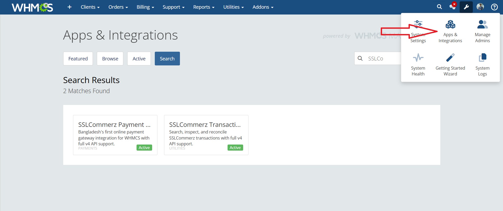
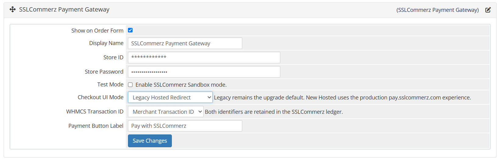
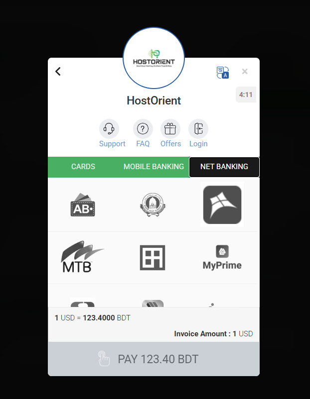
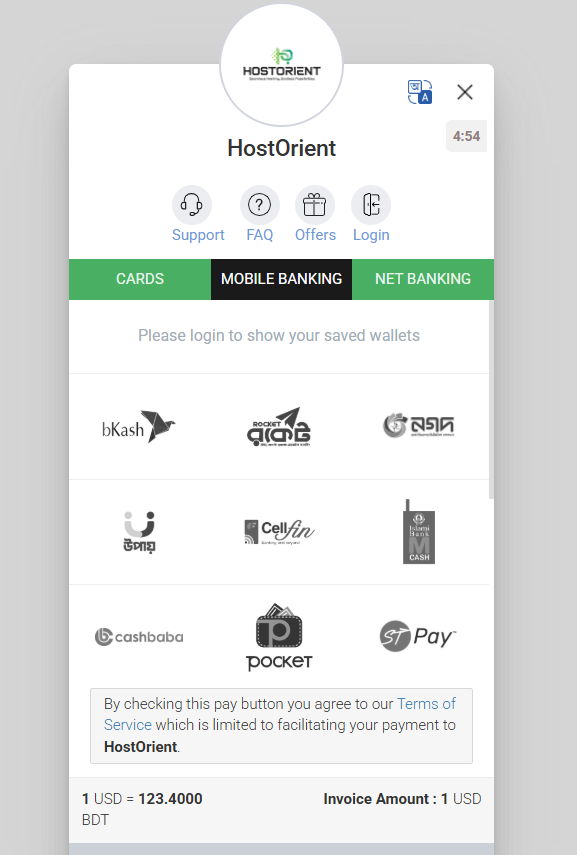
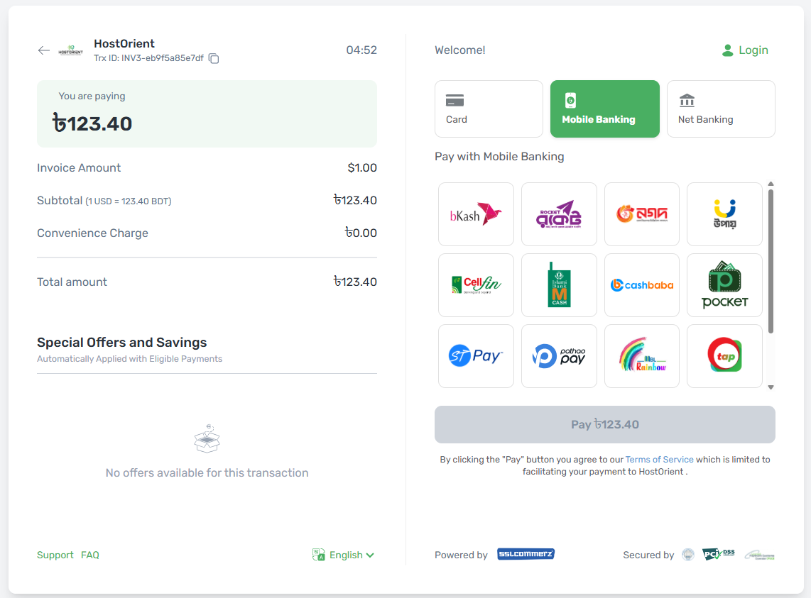
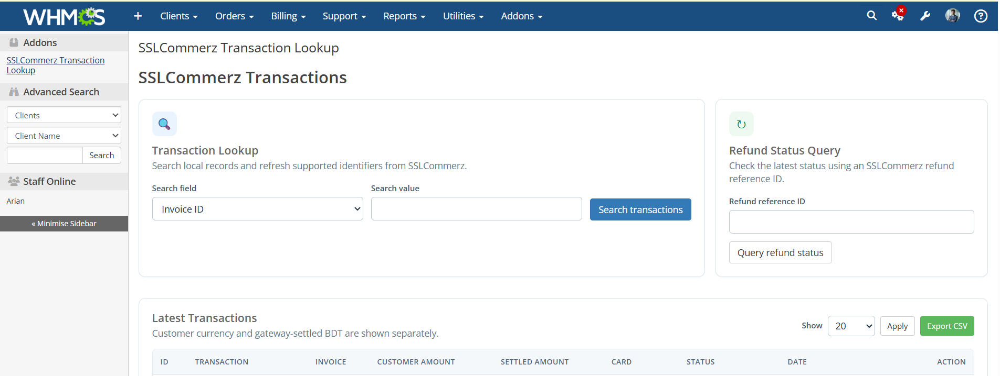

# SSLCommerz for WHMCS

[](CHANGELOG.md)
[](https://www.php.net/)
[](LICENSE)

A production-ready SSLCommerz v4 payment gateway for WHMCS, with secure checkout, callback/IPN settlement, multi-currency reconciliation, refunds, and an optional administrator transaction-lookup add-on.

Version **1.0.0** is the first public production release.

> This is an independent community integration. It is not an official product of, sponsored by, or affiliated with SSL Wireless/SSLCommerz or WHMCS.

## Features

- EasyCheckout popup, Legacy Hosted, and New Hosted checkout modes
- Server-side invoice reload and short-lived HMAC checkout tokens
- Shared, idempotent browser callback and IPN payment processing
- Strict transaction, amount, currency, risk, and identity validation
- Safe USD/foreign-currency to BDT settlement reconciliation
- Full and partial refunds using the payment's captured exchange rate
- Searchable local transaction ledger, remote refresh, and refund status lookup
- Masked card details and formula-safe CSV export
- PHP 7.4-compatible code with automated PHP 7.4 and PHP 8.x checks

## Requirements

- WHMCS 8.x or 9.x
- PHP 7.4 or a supported PHP 8.x release; PHP 8.3 is tested
- PHP cURL and JSON extensions
- A public HTTPS WHMCS System URL with a valid certificate
- SSLCommerz sandbox or live store credentials
- A fixed public outbound/NAT IP registered with SSLCommerz for live refund APIs

## Installation

1. Back up the WHMCS database and any existing SSLCommerz module files.
2. Download the release ZIP and extract it.
3. Copy the extracted `modules` directory into the WHMCS installation root, merging it with the existing `modules` directory.
4. Open **Configuration > Apps & Integrations > Payments** and activate **SSLCommerz Payment Gateway**.
5. Enter the store ID and password, select the environment and checkout mode, then save.
6. Optionally activate **SSLCommerz Transaction Lookup** under **System Settings > Addon Modules** and grant access to the required administrator roles.
7. Complete a sandbox payment and verify both the invoice and **Billing > Gateway Log** before enabling live mode.

For upgrades, replace all gateway, callback, and add-on files together. Keep `legacy_popup` for the first compatibility test and clear any PHP opcode cache after deployment.



## Configuration

Configure the credentials, Test Mode, checkout mode, invoice transaction-ID preference, and gateway display name from the WHMCS payment gateway page. Never commit or share live store credentials.



The local table `mod_sslcommerz_transactions` is created or upgraded lazily on the first gateway or lookup operation. Existing rows are retained.

## Checkout modes

### EasyCheckout popup (`legacy_popup`)

Uses SSLCommerz's official EasyCheckout embed flow. This is the compatibility default for existing installations.



### Legacy Hosted (`legacy_hosted`)

Creates the session on the WHMCS server and redirects the browser to SSLCommerz's hosted checkout.



### New Hosted (`new_hosted`)

Uses the production `pay.sslcommerz.com` experience. Sandbox keeps SSLCommerz's documented sandbox endpoint because a separate sandbox New Hosted endpoint is not published.



Every mode reloads the invoice amount, currency, payment status, and customer data from WHMCS before starting the gateway session.

## Callback and IPN

The gateway submits these endpoints with each checkout session:

- Browser success, failure, and cancellation: `/modules/gateways/callback/sslcommerz.php`
- IPN listener: `/modules/gateways/callback/sslcommerz_ipn.php`

Register the full HTTPS IPN URL in the SSLCommerz store panel if the account requires a static listener. Do not place either endpoint behind login, CAPTCHA, maintenance authentication, or a cache. The callback and IPN suppress PHP session cookies so a cross-site return cannot replace the customer's active WHMCS session.

Browser returns and IPNs use the same validation and settlement processor. Atomic ledger claims and WHMCS transaction checks prevent duplicate invoice credit.

## Currency reconciliation

The module keeps the customer's invoice amount separate from the BDT amount settled by SSLCommerz. A `0.10 USD` invoice settled as `12.34 BDT` is displayed as those two distinct values, never as `12.34 USD`.

For non-BDT invoices, refunds reuse the BDT-per-invoice-currency rate captured during payment. Historical foreign-currency payments without a captured rate are refused because applying a current rate could over-refund. Refund totals are capped at the remaining captured BDT balance, and durable reservations keep concurrent attempts idempotent.

## Refunds

WHMCS refunds use SSLCommerz's refund API. Before using refunds on a live store, ask SSLCommerz to allowlist the WHMCS server's fixed public outbound/NAT IP. `REQUEST_FROM_INVALID_SOURCE` means the API saw an unapproved source IP; it is an account/network restriction rather than a checkout failure.

## Transaction lookup add-on

The administrator add-on provides a minimal dashboard for recent transactions, multi-field search, focused transaction details, reconciliation, refund-status queries, and CSV export.



- The home page can show the latest 10, 20, 50, or 100 attempts.
- Search results replace the recent-transactions list.
- Opening a record shows only its grouped detail table.
- WHMCS native administrator CSRF validation protects state-changing requests.
- Credentials and full card details are excluded or redacted.

## Troubleshooting

- **Popup reports an error in communication:** verify all 1.0.0 files were uploaded together and clear the PHP opcode cache. The popup endpoint accepts SSLCommerz's live `cart_json` wrapper while authenticating the signed invoice token.
- **New Hosted opens the legacy page:** confirm `new_hosted` is saved. Live New Hosted rewrites only SSLCommerz's exact approved live session host to `pay.sslcommerz.com`.
- **Unable to start payment:** inspect the newest `SESSION_FAILED` record in the lookup add-on or **Billing > Gateway Log**. Local, transport, and provider failures are logged while the customer sees a generic message.
- **Invoice remains unpaid:** confirm the public HTTPS callback and IPN endpoints are reachable and that the response matches the original invoice currency amount and settled BDT amount.
- **Customer is logged out after return:** confirm the 1.0.0 callback files replaced older scripts and that no proxy or plug-in injects a session cookie into callback responses.
- **Refund returns `REQUEST_FROM_INVALID_SOURCE`:** register the server's public outbound IP with SSLCommerz, then retry the same refund.
- **Lookup View reports an expired token:** clear the opcode cache. Version 1.0.0 uses WHMCS's native administrator CSRF token and has no custom rotating lookup token.

## Development

Lint the published module PHP files:

```bash
find modules -type f -name '*.php' -print0 | xargs -0 -n1 php -l
```

Build an installable release archive:

```bash
version="$(php -r '$manifest = json_decode(file_get_contents("modules/gateways/sslcommerz/whmcs.json"), true); echo $manifest["version"];')"
mkdir -p dist
zip -q -r "dist/SSLCommerz-WHMCS-Module-${version}.zip" modules README.md CHANGELOG.md LICENSE
```

GitHub Actions runs multi-version PHP syntax checks and builds the installable ZIP artifact. A `v*` tag also creates a GitHub Release containing that archive.

## Security, contributing, and credits

- Read [SECURITY.md](SECURITY.md) before reporting a vulnerability.
- See [CONTRIBUTING.md](CONTRIBUTING.md) for development and pull-request guidance.
- See [ACKNOWLEDGEMENTS.md](ACKNOWLEDGEMENTS.md) for the platforms, tools, projects, and contributors that made this release possible.
- Changes are recorded in [CHANGELOG.md](CHANGELOG.md).

Released under the [MIT License](LICENSE). Copyright © 2026 Extent Technologies Limited.
